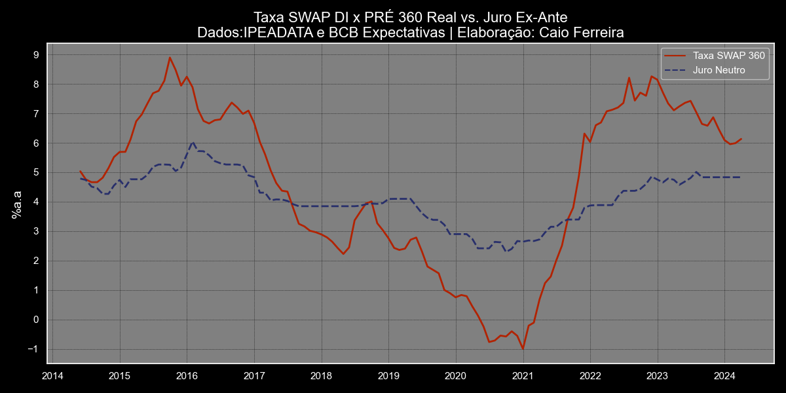

Desenvolvimento da curva de juro neutro ex Ante, utilizando dados da expectativa de inflação e taxa de juros do sistema de expectativas do Banco Central
para comparação com a taxa de juros dos contratos de Swap DI x PRÉ de 360 dias, coletada do sistema de dados do IPEADATA

